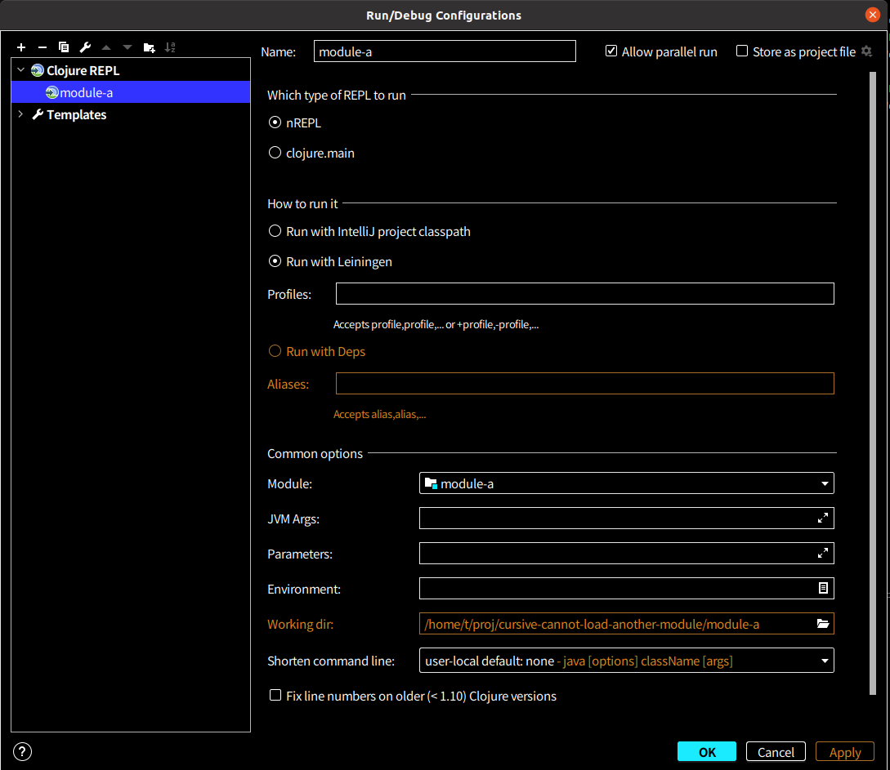

# cursive-cannot-load-another-module

## How to reproduce it

### Prerequisites
My environment: Cursive 1.9.4-2020.2 on Intellij IDEA 2020.2.3 Ultimate Edition.

My module settings
- top module

- module-a

- module-b


My repl settings


### Steps
- setup
```
$ lein modules :checkouts
$ lein modules install
```
- Start module-a REPL.
- Load `module-a.core` with `C-c C-k`. (Emacs keybindings)
- Evaluate `(b.core/foo "hoge")` in `module-a.core`. It prints "hoge Hello, World!".
- Edit `b.core/foo` like this:
```clojure
(defn foo
  "I don't do a whole lot."
  [x]
  (println "changed") ;; editied
  (println x "Hello, World!"))
```
- Load `module-a.core` again with `C-c C-k`. (Emacs keybindings)
- Evaluate `(b.core/foo "hoge")` in `module-a.core`. This doesn't print `changed`.

I think it printed `changed` without restart before the update of this September.

Currently, we need to run `lein modules install` and to restart the REPL to reflect the changes to `module-b`.
Current behavior is awkward for REPL driven development.